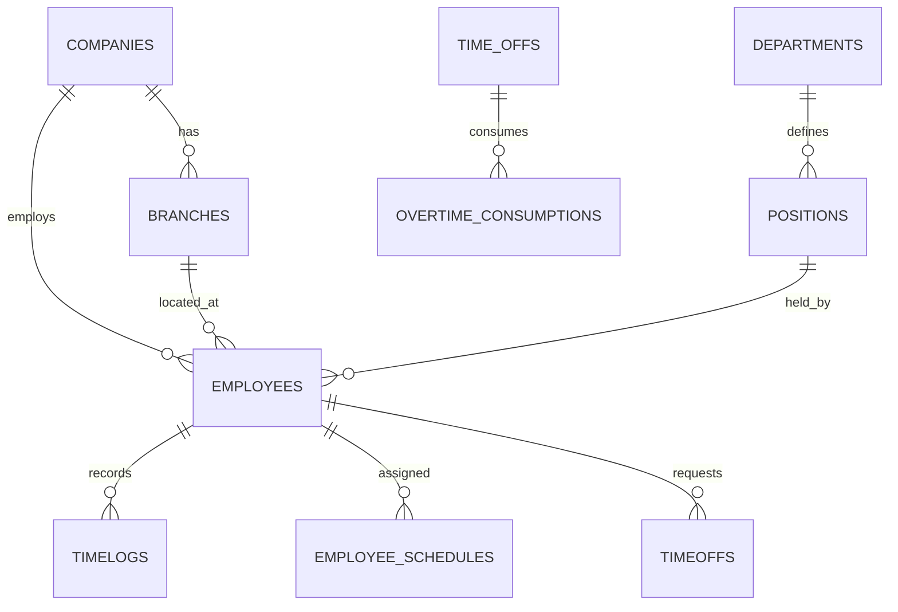

# People Database Schema Documentation

This document describes the structure of the `public` schema for the People project database (PostgreSQL/Supabase).

## 📊 Modules and Tables

### 1. Core Organization

- **companies**: Multi-tenancy support.
- **branches**: Physical locations/branches.
- **departments**: Organizational units.
- **positions**: Job titles and access configurations (`dashboard_access`, `admin`, etc.).
- **organization_chart**: Hierarchical relationships between positions.

### 2. Employee Management

- **employees**: Main employee data (personal, work info, salary).
- **emergency_contacts**: Employee emergency contacts.
- **employee_documents**: Storage for IDs and other files.
- **employee_notes**: Administrative notes for employees.
- **employee_skills / employee_languages**: Qualifications tracking.

### 3. Attendance & Scheduling

- **schedules**: Weekly shift templates (entry/exit times).
- **employee_schedules**: Assignment of schedules to employees over a date range. Includes `approved` flag.
  - `is_compensatory`: Flag indicating the shift is adjusted by a compensatory request.
  - `compensatory_request_id`: Link to the specific `timeoffs` request.
- **timelogs**: Raw punch-in/out records.
- **attendance_sheets**: Aggregated daily data for payroll calculation (late hours, overtime, etc.).

### 4. HR Requests (Timeoffs)

- **employee_vacations**: Approved vacation periods.
- **employee_disabilities**: Medical leave tracking.
- **timeoffs**: General time-off requests, primarily used for **Compensatory** time.
  - `compensatory_type`: 'hours' or 'days'.
  - `review_status`: 'pending', 'approved', 'rejected'.
- **overtime_consumptions**: Links compensatory usage to specific overtime earned.

### 5. Payroll

- **payrolls**: Payroll groups/cycles.
- **payroll_payments**: Individual payment periods.
- **payroll_payment_employees**: Per-employee totals in a payment period.
- **payroll_payment_employee_items**: Granular breakdown of earnings/deductions.
- **payroll_debts**: Employee loans or debts to creditors.
- **payroll_deductions**: System-wide or payroll-specific deduction rules.

### 6. Others

- **complaints / complaint_messages**: Anonymous or identified grievance system.
- **audit_evaluations / audit_answers**: Performance checklists and scoring.
- **notifications**: System-generated alerts.
- **reminders**: Tasks assigned to employees or branches.
- **settings**: Global system configuration.

## 🔗 Key Relationships

## 🔒 Security

- **Row Level Security (RLS)** is enabled on all tables.
- Access is filtered primarily by `company_id` and `employee_id`.
- Roles (HR, Manager, Employee) are determined by `role()` or specific flags in `positions`.
